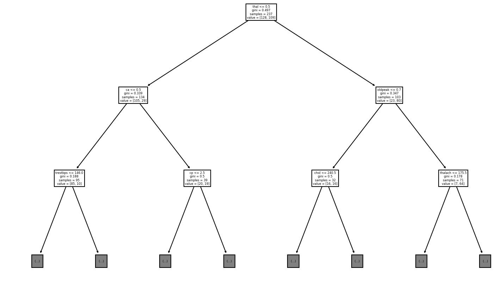

# Heart Disease Cleveland
A quick tree evaluation of the Heart Diseas Cleveland dataset from Kaggle.


```python
import numpy as np
import pandas as pd

from sklearn.metrics import accuracy_score
from sklearn.model_selection import train_test_split
from sklearn import tree

import matplotlib.pyplot as pyplot
pyplot.rcParams['figure.dpi'] = 150
pyplot.rcParams['savefig.dpi'] = 150
```

The ultimate aim is to predict whether a patient has heart disease or not. First
we load the available data, which contains the information for each patient,
including the coding whether the have heart desease (condition == 1) or not
(condition == 0).


```python
heart_cleveland = pd.read_csv('heart_cleveland_upload.csv')
print(heart_cleveland.head())
print(heart_cleveland.shape)
```

       age  sex  cp  trestbps  chol  fbs  restecg  thalach  exang  oldpeak  slope  \
    0   69    1   0       160   234    1        2      131      0      0.1      1   
    1   69    0   0       140   239    0        0      151      0      1.8      0   
    2   66    0   0       150   226    0        0      114      0      2.6      2   
    3   65    1   0       138   282    1        2      174      0      1.4      1   
    4   64    1   0       110   211    0        2      144      1      1.8      1   
    
       ca  thal  condition  
    0   1     0          0  
    1   2     0          0  
    2   0     0          0  
    3   1     0          1  
    4   0     0          0  
    (297, 14)


Next we extract the X (predictors) and Y (condition) values and split them into
test and train sets.


```python
X = heart_cleveland.drop(columns=['condition'])
Y = heart_cleveland.loc[:, 'condition']

train_x, test_x, train_y, test_y = train_test_split(X, Y, test_size=.2, random_state=42)

print(train_x.shape)
print(test_x.shape)
print(train_y.shape)
print(test_y.shape)
```

    (237, 13)
    (60, 13)
    (237,)
    (60,)


To start to identify the most powerful predictors we build a basic classification
tree.


```python
accuracies = {}
best_accuracy = 0

for min_sample_split in range(train_y.size, 2, -1):
    heart_tree = tree.DecisionTreeClassifier(max_leaf_nodes=min_sample_split)
    heart_tree = heart_tree.fit(train_x, train_y)
    pred_y = heart_tree.predict(test_x)
    try:
        accuracies[accuracy_score(test_y, pred_y)].append(min_sample_split)
    except KeyError:
        accuracies[accuracy_score(test_y, pred_y)] = [min_sample_split]

    if accuracy_score(test_y, pred_y) >= best_accuracy:
        best_accuracy = accuracy_score(test_y, pred_y)
        best_model = heart_tree

print("Most accurate model has a maximum of ",
      best_model.get_n_leaves(), " leaf nodes.")

best_pred_y = best_model.predict(test_x)
print("The accurace of the model is", accuracy_score(test_y, best_pred_y))

tree.plot_tree(best_model, max_depth=2, feature_names=train_x.columns)
```

    Most accurate model has a maximum of  39  leaf nodes.
    The accurace of the model is 0.7666666666666667


    [Text(348.75, 396.375, 'thal <= 0.5\ngini = 0.497\nsamples = 237\nvalue = [128, 109]'),
     Text(174.375, 283.125, 'ca <= 0.5\ngini = 0.339\nsamples = 134\nvalue = [105, 29]'),
     Text(87.1875, 169.875, 'trestbps <= 146.0\ngini = 0.188\nsamples = 95\nvalue = [85, 10]'),
     Text(43.59375, 56.625, '\n  (...)  \n'),
     Text(130.78125, 56.625, '\n  (...)  \n'),
     Text(261.5625, 169.875, 'cp <= 2.5\ngini = 0.5\nsamples = 39\nvalue = [20, 19]'),
     Text(217.96875, 56.625, '\n  (...)  \n'),
     Text(305.15625, 56.625, '\n  (...)  \n'),
     Text(523.125, 283.125, 'oldpeak <= 0.7\ngini = 0.347\nsamples = 103\nvalue = [23, 80]'),
     Text(435.9375, 169.875, 'chol <= 240.5\ngini = 0.5\nsamples = 32\nvalue = [16, 16]'),
     Text(392.34375, 56.625, '\n  (...)  \n'),
     Text(479.53125, 56.625, '\n  (...)  \n'),
     Text(610.3125, 169.875, 'thalach <= 175.5\ngini = 0.178\nsamples = 71\nvalue = [7, 64]'),
     Text(566.71875, 56.625, '\n  (...)  \n'),
     Text(653.90625, 56.625, '\n  (...)  \n')]


    

    

